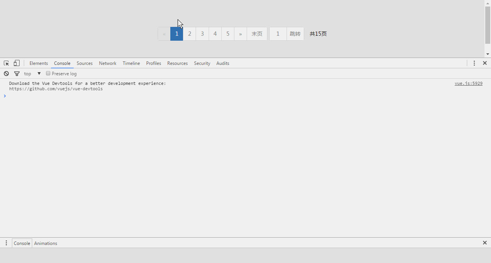

# vue-pager 分页插件

上手学了Vue2.0，简单实现了一个分页组件

#### Html
```
<div id="pagerWrap">
    <pager :total="pageTotal" :current="pageCurrent"></pager>
</div>
```

#### 引入
```
<link rel="stylesheet" type="text/css" href="pager.css">
<script src="https://unpkg.com/vue@2.1.4/dist/vue.js"></script>
<script src="pager.js"></script>
```

#### 效果图
[](demo.gif)